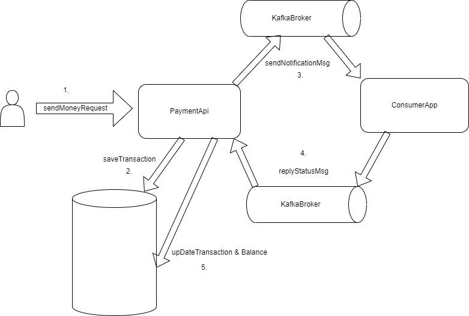

# Instant Payment API

### Short descriptions

The application has multiple endpoints, if the endpoint receive the userIds and the idempotencyKey (wich will identify the request itself).
If it is not a duplicated request, then the app will save the transactions into postgress table with a Status (EXECUTING, SUCCES, FAILED).
The application will upload the Wallet table with 2 item at startUp time.
Initially every transaction start with EXECUTING status (obviously in a real world env we can introduce more status, before EXECUTING as well etc...)
If the the db is available and every db operation finished successfully we will send a kafka notification to the recipient (with idempotencyKey as well).
On the Consumer side we have a simple dummy Kafka app wich is just listening and send back the kafkaMessage about the transaction (in this example it is always SUCCESS)
to demonstrate the functionality.
The paymentApi is listening on this topic (topic-event-2), if the payment is succes, then we update the Transaction Status in the postgres table to SUCCES
and update the balance as well.

With the openAPI ui we can demonstrate the sendMoney functionality and check the result with the getStatus and getBalance endpoints.

In this example we have a Wallet table as well, where the walletId represents the userId as well.

### API endpoints

In the root directory we can find a docker-compose.yml wich contains all the appropriate service.
(postgresSQl, Kafka broker, Kafka-UI, paymentApi app, ConsumerApp)

docker-compose up

Kafka-UI: http://localhost:8080/ (to validate the message traffic on kafka)
SwaggerUI: http://localhost:7000/swagger-ui/index.html  to test the endpoints.

docker-compose up

### API endpoints

POST
	/payment/sendMoney
GET
	/payment/getBalance/{userId}
	/payment/getStatus/{idempotencyKey}
	

### Example sendMoney query (we will send money from user 1 to user 2)

{
  "idempotencyKey": "3fa85f64-5717-4562-b3fc-2c963f66afa6",
  "fromUserId": 1,
  "toUserId": 2,
  "amount": 12,
  "creditCardDetails": "string"
}

### API diagram

### Faul Tolerance, resilience

For the Faul Tolerance and resilience i added some feature like bulkHead to ensure to do not overload the endpoints.
Pessimistic lock, for write operations to avoid the concurency issues
CircuitBreaker on Kafka to ensure the high availability and fault tolerance.

